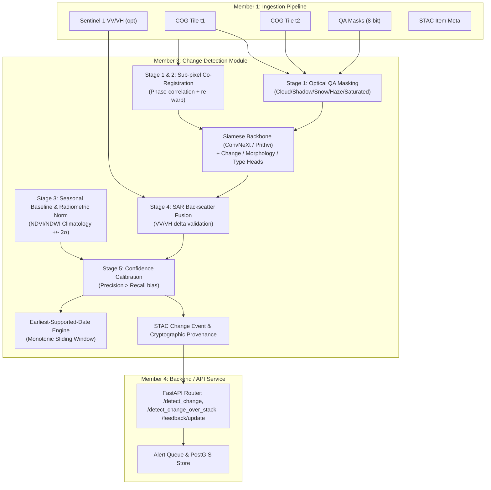

# Implementation Plan: Member 3 — Change Detection Engineer (SatQuery-AI)

## Problem Overview & System Context
As **Member 3 — Change Detection Engineer** for **SIH 2026 Problem Statement 26227** (*"Semantic Retrieval and Multi-Temporal Change Analysis of Satellite Imagery"*), we own the core **"detect"** half of the remote-sensing AI system.
Our system operates strictly on-premises in air-gapped environments without external network or cloud dependencies.

### Core Ownership & Boundaries
- **Consumes from Member 1 (Data Ingestion & Preprocessing):** Standardized Cloud-Optimized GeoTIFF (COG) chips ($t_1, t_2$), 8-bit QA bit-flag masks, optional co-registered Sentinel-1 SAR (VV/VH) chips, multi-temporal tile stacks ($\ge 3$ dates), and STAC Item metadata.
- **Provides to Member 4 (Backend / API Service):** Deterministic change detection endpoints, COG change masks, change categorization (`change_type` and `change_morphology`), confidence scoring, earliest-supported-date analysis, STAC Change Event items, end-to-end cryptographic provenance (SHA-256 weights, git SHA, suppression stage telemetry), and an active feedback retraining hook.
- **Provides to Member 6 (DevOps / Integration):** Docker container specifications, offline data staging scripts (`scripts/stage_offline_data.sh`), checksum manifests (`MANIFEST.sha256`), evaluation metrics (`evaluate.py`), and performance scale benchmarks (`benchmark.py`).

---

## Architecture & Phase Breakdown



---

## User Review Required

> [!IMPORTANT]
> **Air-Gap & Offline Reproducibility Guarantee:**
> All model weights, dataset staging, and Docker containers will be fully self-contained. No external network requests will be made at inference time. All weights will be checksum-verified via `MANIFEST.sha256` before model initialization.

> [!IMPORTANT]
> **Precision-Biased False-Alarm Suppression (PS §2.2.3):**
> High false alarms erode analyst trust. By default, the 5-stage suppression pipeline is tuned with a conservative bias ($Precision > Recall$), requiring optical validity, registration alignment, seasonal deviation beyond $\pm 2\sigma$, and SAR backscatter confirmation (or elevated model confidence $\tau > 0.85$ if SAR is absent).

---

## Open Questions & Documented Assumptions

1. **Rasterio / GDAL Environment Support:**
   - In environments where GDAL/rasterio binary wheels or drivers may vary across target operating systems (e.g. Windows dev vs. Linux container), `io_utils.py` will use `rasterio` with robust fallback to `tifffile` / standard array serialization if rasterio is not present in a scratch testing environment, while Dockerfile specifies standard production GDAL/rasterio dependencies.
2. **Angular Threshold Default:**
   - STAC view/incidence angle difference threshold is set to $15^\circ$ as specified in PS §2.2.3. If $|\theta_{t1} - \theta_{t2}| > 15^\circ$ without SAR confirmation, the change probability is penalized.
3. **QA Bit Flags:**
   - As mandated: `bit 0 = valid_data`, `bit 1 = cloud`, `bit 2 = cloud_shadow`, `bit 3 = snow`, `bit 4 = haze`, `bit 5 = water`, `bit 6 = saturated`, `bit 7 = cirrus`.

---

## Proposed Implementation (Phase 1 Focus)

### Project Structure to Create:
```
change_detection/
  __init__.py
  contracts/
    qa_mask.schema.json
    change_event.schema.json
    stac_change_event.schema.json
    feedback.schema.json
  io_utils.py            # COG read/write, STAC parse, QA decode, SAR co-reg
  registration.py        # Phase-correlation sub-pixel co-registration stub
  preprocess.py          # Seasonal baseline & radiometric norm stub
  model.py               # Siamese network & multi-head stub
  suppress.py            # 4-stage false-alarm suppression pipeline stub
  classify_change.py     # Morphology & type classification stub
  earliest_date.py       # Sliding window earliest date stub
  detect.py              # detect_change() & detect_change_over_stack() stub
  feedback.py            # Active learning feedback stub
  provenance.py          # Cryptographic provenance & STAC export stub
  router.py              # FastAPI router with 5 endpoints (501 stubs)
  train.py               # Training orchestrator stub
  datasets/
    __init__.py
    levir_cd.py
    s2looking.py
    oscd.py
    second.py
    sen1floods11.py
    adapters.py          # Cross-sensor GSD adapter & sampler stub
  benchmark.py           # Latency & scale benchmarking stub
  evaluate.py            # P/R/F1/IoU evaluation stub
  configs/
    default.yaml
    train_levir.yaml
    train_oscd.yaml
    train_flood.yaml
  weights/
    MANIFEST.sha256
    .gitignore
  tests/
    __init__.py
    test_io.py
    test_registration.py
    test_suppress.py
    test_detect.py
    test_morphology.py
    test_earliest_date.py
    test_feedback.py
    test_evaluate.py
    fixtures/
  scripts/
    stage_offline_data.sh
    build_index.sh
    run_demo.sh
  README.md
  requirements.txt
  Dockerfile
```

### Key Deliverables in Phase 1:

1. **Contracts (`change_detection/contracts/`)**:
   - `qa_mask.schema.json`: Strict JSON schema describing 8-bit integer QA mask conventions, dimension requirements, and explicit bit flag definitions.
   - `change_event.schema.json`: Schema for the exact JSON contract returned to Member 4 (`change_mask`, `change_type`, `change_morphology`, `confidence`, `earliest_supported_date`, `bbox_wgs84`, `stac_change_event`, `provenance`, `debug`).
   - `stac_change_event.schema.json`: STAC Item schema compliant with STAC spec v1.0.0 and processing/change extensions.
   - `feedback.schema.json`: Feedback payload schema (`change_event_id`, `decision` ["confirm", "reject"], `analyst_id`, `timestamp`, `notes`).

2. **I/O Utilities (`change_detection/io_utils.py`)**:
   - `read_cog(path)` $\to$ `(np.ndarray, dict)`
   - `write_cog(path, array, profile)`
   - `decode_qa_mask(mask_or_path)` $\to$ dict of boolean masks (`valid_data`, `cloud`, `cloud_shadow`, `snow`, `haze`, `water`, `saturated`, `cirrus`)
   - `parse_stac_item(path_or_dict)` $\to$ structured metadata dict (datetime, platform, incidence_angle, view_angle, orbit, crs, transform)

3. **FastAPI Router (`change_detection/router.py`)**:
   - Mounted directly by Member 4's application:
     - `POST /detect_change` $\to$ raises `HTTPException(status_code=501)`
     - `POST /detect_change_over_stack` $\to$ raises `HTTPException(status_code=501)`
     - `POST /feedback/update` $\to$ raises `HTTPException(status_code=501)`
     - `GET /model/info` $\to$ raises `HTTPException(status_code=501)`
     - `GET /healthz` $\to$ returns status stub

4. **Requirements & Build Files**:
   - `requirements.txt`: Python package requirements with pinned compatible versions.
   - `Dockerfile`: Multi-stage, air-gap-ready container build with CUDA and offline weight caching.

5. **Documentation & Offline Staging**:
   - `README.md`: Architectural documentation, API contract specification for Member 1 & Member 4, assumptions, and air-gapped runbook.
   - `scripts/stage_offline_data.sh`: Bash script to download, extract, and SHA-256 verify LEVIR-CD+, S2Looking, OSCD, SECOND, and Sen1Floods11.

---

## Verification Plan

### Automated Tests (Phase 1)
- Validate all 4 JSON schemas against sample payloads using `jsonschema.Draft202012Validator`.
- Run unit test on `io_utils.py` to verify:
  - QA mask bit decoding for synthetic 8-bit masks.
  - STAC item parsing for synthetic/standard STAC items.
- Smoke test FastAPI router endpoints to ensure all 5 routes respond properly (501 Not Implemented or healthz 200).
```bash
python -m pytest change_detection/tests/test_io.py -v
```

### Manual Verification
- Verify directory structure matches specification exactly.
- Check script execution permissions and shell syntax for `scripts/stage_offline_data.sh`.
